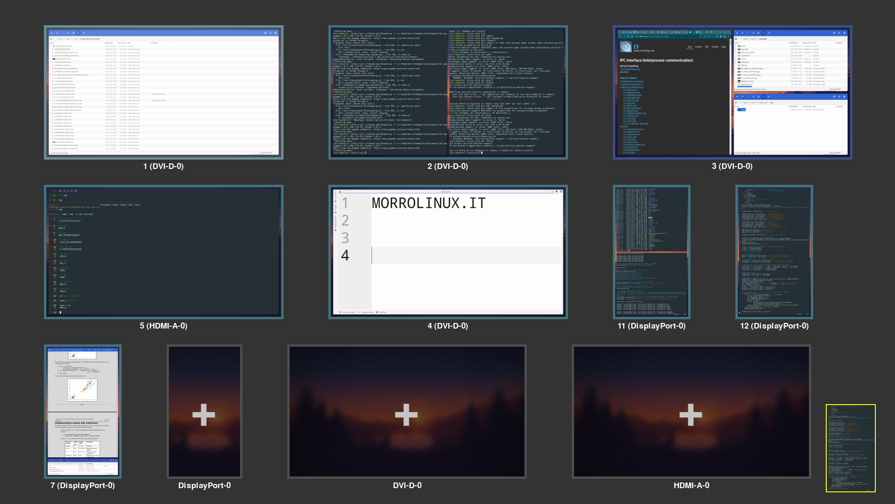

# Overwiew

Expo is an simple and straightforward way to get a visual impression of all your
current virtual desktops that many compositing window managers use.  It's not a
very powerful approach, but a very intuitive one and especially fits workflows
that use lots of temporary windows or those in which the workspaces are mentally
arranged in a grid.

i3expo emulates that function within the limitations of a non-compositing window
manager. By listening to the IPC, it takes a screenshot whenever a window event
occurrs. Thanks to an extremely fast C library, this produces negligible
overhead in normal operation and allows the script to remember what state you
left a workspace in.

The script is run as a background process and reacts to signals in order to open
its UI in which you get an overview of the known state of your workspaces and
can select another with the mouse or keyboard.

# This fork

This fork adds:
- Dynamic workspace grid (changes size depending on how many workspaces you have)
- Multi-monitor support
- Vertical monitor support
- Compact view for better use of screen real estate 
- Drag focused window to a new or different workspace 
- Create a new workspace on any monitor with one click
- Bugfixes and performance improvements (via cache)
- Visual/Aesthetic perks 
- Zero configuration service with reasonable default settings

Example output:

# Dependencies

- Python 3
- PyGame
- i3ipc

# Usage

Compile the `prtscn.c` as follows:

`gcc -shared -O3 -Wall -fPIC -Wl,-soname,prtscn -o prtscn.so prtscn.c -lX11`

Put the `prtscn.so` in the same directory as the Python script (or adjust the
location in the code).

Put `defaultconfig` into `$XDG_CONFIG_DIR/i3expo/config`.
Colors can be specified by using their PyGame names or in #fff or #ffffff hex.

Add this to your `i3` config
`exec_always "~/i3expo-ng/i3expod.py -f -w /home/user/Images/wallpapers/14.jpg"`

`-f` is for fullscreen 

`-w` is for wallpaper. Should match your i3 wallpaper

**All parameters are optional.**

Send `SIGUSR1` to `i3expod.py` to show the Expo UI, for example by adding 
`bindsym $mod+Tab exec --no-startup-id "killall -s SIGUSR1 i3expod.py"` to your i3 `config`. Send `SIGHUP`
to have the application reload its configuration.

Navigate the UI with the mouse or with they keyboard using `hjkl`, the arrow
keys, Return and Escape.

# Limitations

Since it works by taking screenshots, the application cannot know workspaces it
hasn't seen yet. Furthermore, the updates are less continuous than you might be
used to if you're coming from a compositing WM where they can happen live and in
the background.

When you drag the active window to a new or another workspace, 
the screenshot of the current workspace won't be updated until the workspace isn't 
visited back again, and will continue to show the window you moved. 
There's no clean way to handle this as it would require taking a screenshot of the workspace
after you changed it and before jumping to the new/other workspace you dragged your window to.

~~Empty workspaces don't technically exist to i3 and are thus inaccessible in the
default config because it's not possible to handle named inexistant workspaces.
If you still want to access them, you will have to set
`switch_to_empty_workspaces` to `True` and define your names under `Workspaces`
like e. g. `workspace_1 = 1:Firefox`.~~

# Bugs

Stalled windows whose content i3 doesn't know cause interface bugs and could
probably be handled better, but this needs more testing.

# Todo

~~It's theoretically feasible to take the window information from i3's tree and
allow for dragging of windows from one workspace to another or even from
container to container. However, this would be massively complex (especially on
the UI side) and it's not clear if it would be worth the effort.~~  **<-- Kind of did it. It was worth it :)**

~~And getting it into a publishable state, obviously.~~

# Credit

Stackoverflow user JHolta for the screenshot library to be found in this thread:
https://stackoverflow.com/questions/69645/take-a-screenshot-via-a-python-script-linux

GitLab/Reddit user d.reis for the idea and initial implementation which got me started :)
https://www.reddit.com/r/i3wm/comments/8at5dv/i_wrote_an_expolike_script_for_i3/

https://gitlab.com/d.reis/i3expo
